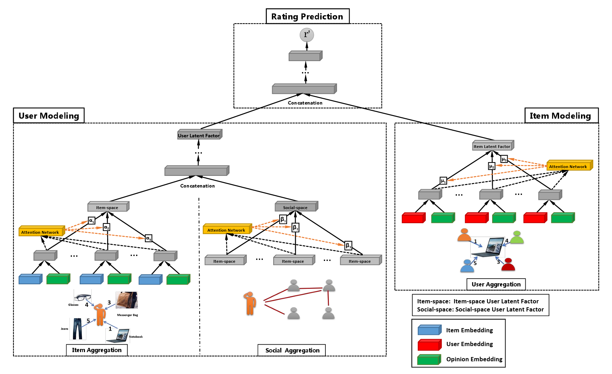

<h1 align="center">Recommendation system using Graph neural networks</h1>

  

    <a href="#introduction">Introduction</a> •
    <a href="#models">Models</a> •
    <a href="#results">Results</a> •
    <a href="#conclusion">Conclusion</a>

## Introduction

GraphRec is a graph-based recommendation model that leverages Graph Neural Networks (GNNs) to enhance the accuracy of recommendations. The model is designed to capture both user-item interactions and social relationships among users. This dual approach helps address common issues in recommendation systems such as data sparsity and the cold-start problem. The project compares GraphRec with two other models, LightGCN and SocialMF, using the Ciao dataset to evaluate performance in terms of accuracy and computational efficiency.

To download Ciao dataset : [Raw dataset](https://www.cse.msu.edu/~tangjili/Ciao.rar) 

## Models

LightGCN simplifies traditional Graph Convolutional Networks by removing non-linearities and feature transformation steps. It focuses solely on propagating embeddings across the graph. This makes LightGCN efficient and scalable, although it remains sensitive to data sparsity.

SocialMF is a matrix factorization model enhanced with a regularization term based on social connections. It promotes similarity in latent preferences between connected users. SocialMF is computationally light and performs well in social recommendation contexts, especially where user-item interactions are limited.

GraphRec is the most advanced model in this project. It utilizes both the user-item interaction graph and the social graph to create expressive user and item embeddings. Its architecture includes user and item encoders as well as a prediction network. GraphRec achieves high prediction accuracy but produces embeddings that lack semantic structure, as shown in later analysis.

  

## Results

When evaluated on the Ciao dataset, LightGCN achieved a Mean Absolute Error (MAE) of 0.4682 and a Root Mean Square Error (RMSE) of 0.5961. These results show that LightGCN effectively leverages the interaction graph to make accurate predictions while maintaining scalability.

SocialMF, though simpler in design, produced an MAE of 0.7808 and an RMSE of 1.0554. While its performance is lower compared to the other models, it remains a viable option when computational resources are limited and social relationships are important.

GraphRec yielded an MAE of 0.75 and an RMSE of 1.15, closely matching results from the original paper. It effectively integrates social and interaction data through a deep GNN, achieving strong predictive performance. However, analysis of its embeddings using techniques like t-SNE and K-Means revealed a lack of clear clustering, indicating limited interpretability.

| Model      | MAE    | RMSE   |
|------------|--------|--------|
| LightGCN   | 0.4682 | 0.5961 |
| SocialMF   | 0.7808 | 1.0554 |
| GraphRec   | 0.7500 | 1.1500 |

# Conclusion

The three models offer different advantages depending on the application. LightGCN is well-suited for large-scale collaborative filtering scenarios where efficiency and scalability are key. SocialMF is ideal when a simple, interpretable model is needed, particularly in settings where social connections are a valuable source of information. GraphRec, while more complex, provides strong predictive power and is appropriate when maximum accuracy is required.

Together, these models illustrate the trade-offs between accuracy, complexity, and interpretability in graph-based recommendation systems.

